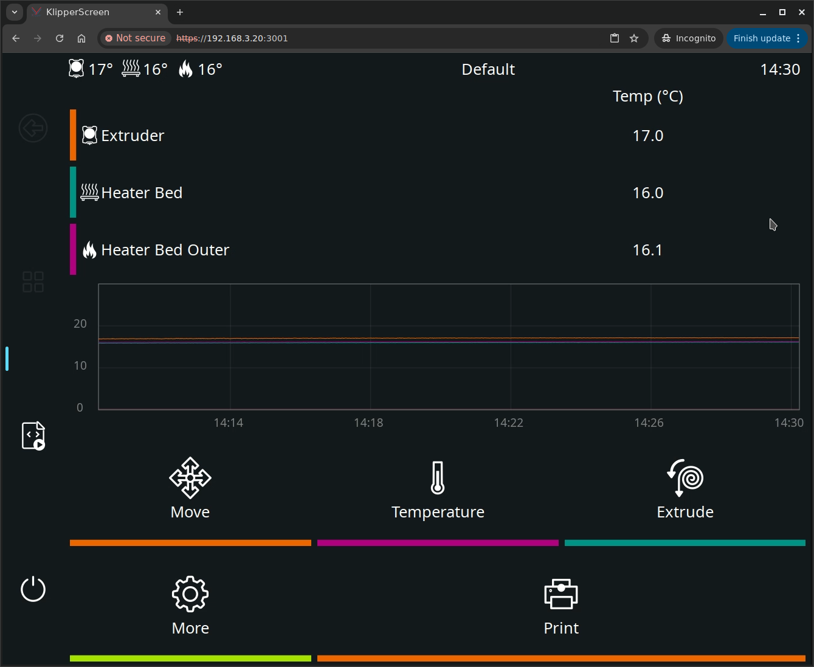

# KlipperScreen Docker

Run [KlipperScreen](https://github.com/KlipperScreen/KlipperScreen) as a Docker container with browser-based access — no VNC client required.



## Why?

KlipperScreen is a touchscreen GUI for Klipper 3D printers. Traditionally, running it on a [remote device](https://klipperscreen.github.io/KlipperScreen/VNC/) requires installing a VNC client or Xserver-XSDL app.

This container eliminates that requirement by providing **web-based access** via your browser. You can:

- Host KlipperScreen on any Docker host (doesn't need to be on the printer, probably shouldn't be)
- Access it from any device with a web browser (tablet, phone, computer)
- Use kiosk browser apps like [Fully Kiosk Browser](https://www.fully-kiosk.com/) for a dedicated display

## Quick Start

### Option 1: Environment Variables (Recommended)

The simplest way to get started — just set `MOONRAKER_HOST`:

```bash
docker run -d \
  --name klipperscreen \
  -p 3001:3001 \
  -e MOONRAKER_HOST=192.168.1.100 \
  ghcr.io/gpdenny/klipperscreen-web:latest
```

### Option 2: Docker Compose

```yaml
services:
  klipperscreen:
    image: ghcr.io/gpdenny/klipperscreen-web:latest
    container_name: klipperscreen
    environment:
      - PUID=1000
      - PGID=1000
      - TZ=Etc/UTC
      - MOONRAKER_HOST=192.168.1.100
      - MOONRAKER_PORT=7125
    volumes:
      - ./config:/config
    ports:
      - 3001:3001
    restart: unless-stopped
```

See [`docker-compose.yml`](docker-compose.yml) for a complete example.

### Option 3: Config File Only

For advanced setups (multiple printers, custom settings), skip the environment variables and edit the config file directly:

```bash
docker run -d \
  --name klipperscreen \
  -p 3001:3001 \
  -v ./config:/config \
  ghcr.io/gpdenny/klipperscreen-web:latest
```

Then edit `config/KlipperScreen.conf`:

```ini
[printer My Printer]
moonraker_host: 192.168.1.100
moonraker_port: 7125
```

Then open `http://<your-docker-host>:3001` in your browser.

## Environment Variables

| Variable | Default | Description |
|----------|---------|-------------|
| `MOONRAKER_HOST` | - | Moonraker IP/hostname (enables auto-config) |
| `MOONRAKER_PORT` | `7125` | Moonraker port |
| `MOONRAKER_API_KEY` | - | Moonraker API key (if required) |
| `PUID` | `1000` | User ID for file permissions |
| `PGID` | `1000` | Group ID for file permissions |
| `TZ` | `Etc/UTC` | Timezone |

> **Note:** Config is only generated on first run if `/config/KlipperScreen.conf` doesn't exist. Any changes made through the UI are preserved across restarts. Delete the config file to regenerate from environment variables.

## Credits

- [KlipperScreen](https://github.com/KlipperScreen/KlipperScreen) by Jordan Ruthe & Alfredo Monclus
- Built on [LinuxServer.io](https://linuxserver.io) base images
